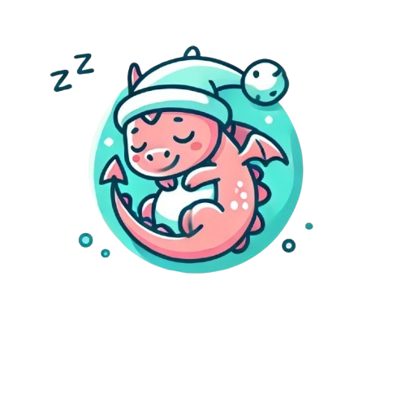

# Dream kids

  

* Link do [Designe](https://www.canva.com/design/DAGU3r7zZuM/vj8VNRsqzF4x5e6m3vM8Fg/edit?utm_content=DAGU3r7zZuM&utm_campaign=designshare&utm_medium=link2&utm_source=sharebutton)

# Features

> Itens clicaveis e funcionais:
  * Botão de inicio.
  * Botão de pesquisar.
  * Botão de notificações.
  * Botão de perfil.
  * Imagem do desenho Sara e o Pato com redirecionamento.

# Navegação

* Apenas a imagem com o desenho Sarah e o pato ira redirecionar para uma pagina falando sobre o desenho, as demais imagens não fazem redirecionamento.
* Apenas os botões de inicio, pesquisar, notificaçao e perfil presentes no header funcionam, os botões de serie e filme não funcionam.
* Os botões do Footer não funcionam.
* Não e possivel realmente assistir o desenho diretamente pelo site.
* O perfil e demonstrativo, as configurações dele não podem ser mudadas.

# Referencias

> Header em todas as abas

* `logo.png`

> Index.html

* `https://img.odcdn.com.br/cdn-cgi/image/width=1200,height=1200,fit=cover/wp-content/uploads/2021/02/gumball.jpg`
* `https://encrypted-tbn3.gstatic.com/images?q=tbn:ANd9GcTnDc7M3EleSSwg1BhfEy-R4AfPMtGkyVF6-KgRwbARx0oXP7otJhuM_YZ9PtzKoDmjIwAUkC_rPwqBoq2PocSAC23rw9P6oiE0nLWk5A`
* `https://encrypted-tbn0.gstatic.com/images?q=tbn:ANd9GcTaP6L_MSm0b23W8FSzBuKfc0rUXCJf0Sja2w&s`
* `https://encrypted-tbn0.gstatic.com/images?q=tbn:ANd9GcS1KxzhMyS1r5212FIBni_I541wjEKT_GY-4Q&s`
* `https://blog.mooui.com.br/wp-content/uploads/2018/06/melhores-desenhos-infantis-2.jpg`
* `https://pt.quizur.com/_image?href=https%3A%2F%2Fimg.quizur.com%2Ff%2Fimg64e7db5c8368b0.62845709.jpg%3FlastEdited%3D1692916577%3Fo%3Dfeed&w=250&h=300&f=webp`
* `https://encrypted-tbn0.gstatic.com/images?q=tbn:ANd9GcSFTTW0LXffvO3Y3bWrSd0gRw8-4plMyUiszA&s`
* `https://atlantidasc-prod.s3.amazonaws.com/wp-content/uploads/2023/12/image-61.png`
* `https://miro.medium.com/v2/resize:fit:1400/0*NSh9l4y6n8BGsYqv.`

> pg2.html

* `https://www.dvdskskids.com.br/image/cache/catalog/DVDs/Sarah%20e%20o%20Pato%201-500x500.PNG`
* `https://tvbrasil.ebc.com.br/sites/default/files/atoms/image/05_07_63mb_0_grande.jpg`
* `https://images-01.ottvs.com.br/0047209/looke_1010_670.jpg`
* `https://encrypted-tbn0.gstatic.com/images?q=tbn:ANd9GcQSsZGTOFR47ylTLejzZWVqQdN_y8SO1kE_lA&s`
* `https://encrypted-tbn0.gstatic.com/images?q=tbn:ANd9GcR1d_Ye-9-U_-C1JzhWBcR2uiYUorS5T75_qQ&s`
* `https://encrypted-tbn0.gstatic.com/images?q=tbn:ANd9GcRc8uEz8U8VpRMhkLuw0S3svTj0VtGxeo-XlQ&s`
* `https://encrypted-tbn0.gstatic.com/images?q=tbn:ANd9GcQQEAfqYPvbxacg9wSL2O83MPj7d2CHQ8wMQw&s`

> pg3.html

* `https://storage.googleapis.com/a1aa/image/atgkgE8ckxrTNNGF3csb52ELoP2eETk1doIvvf3rZ6yH7YxTA.jpg`

# Decisões 

* As decisoes do projeto foram tomas em grupo com todos concordando.
* O tema de site de streamer infantil foi uma ideia inovadora que tentamos ter para aplicar e não ser um site comum.
* Prazos e entregas foram algo dificil no projeto, algumas pessoas em determinadas vezes não colaboraram e assim acabaram atrasando partes q logo mais ja foram corrigidas.
* O trabalho em grupo em si foi tranquilo apesar dos imprevistos.
